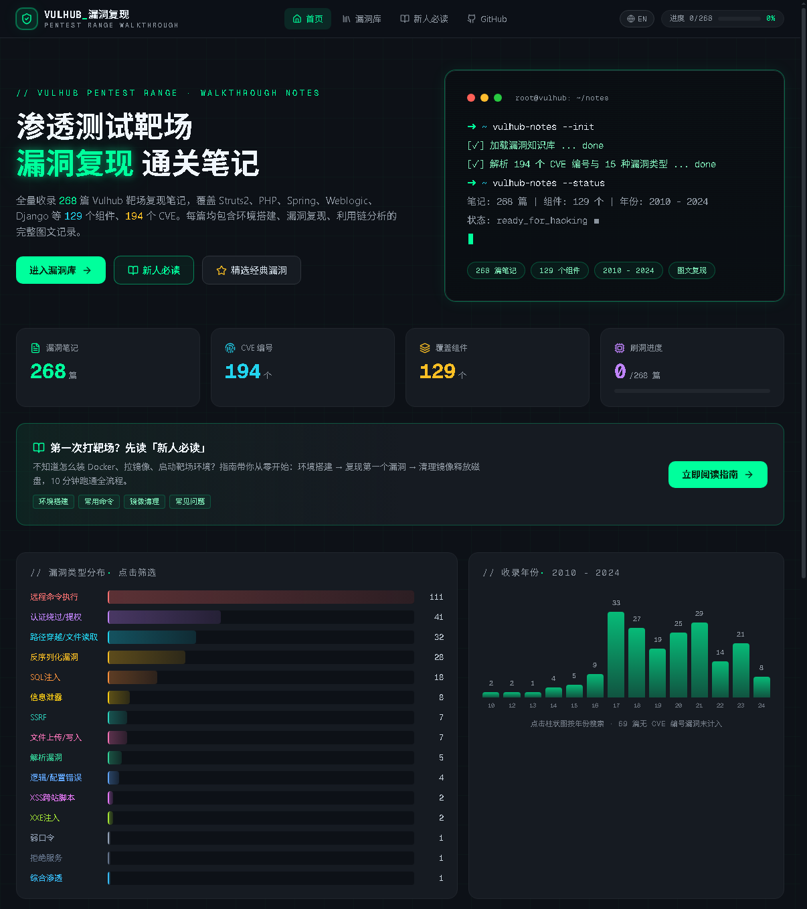
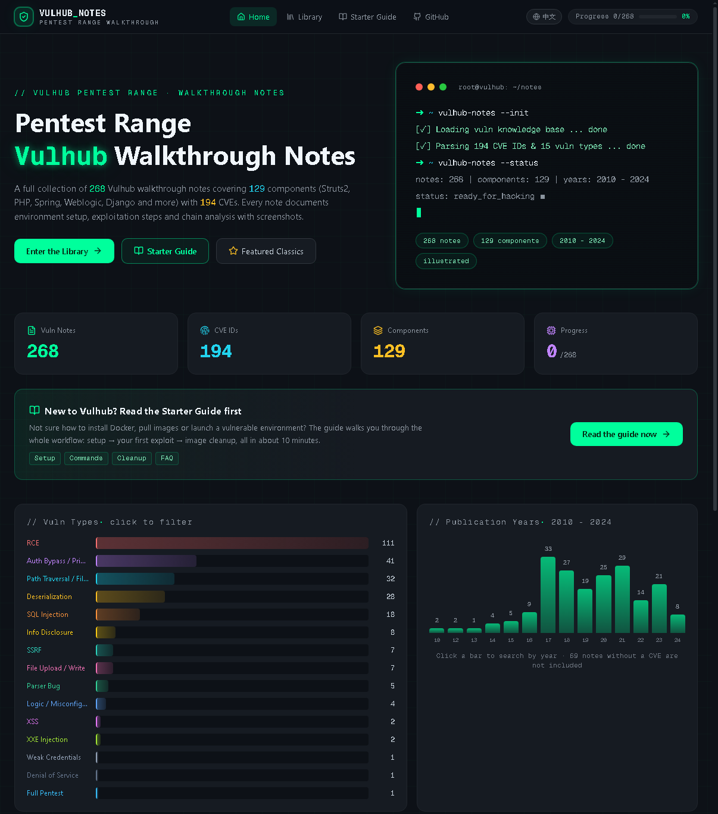

<div align="center">

[简体中文](README.md) ｜ **English**

# `>_ VulhubTutorialNotes`

**Vulhub Pentest Range · Walkthrough Notes**

[](https://testdd.dpdns.org/)
[](https://testdd.dpdns.org/)
[](https://testdd.dpdns.org/)
[](https://testdd.dpdns.org/)

🌐 **Read Online** → [https://testdd.dpdns.org](https://testdd.dpdns.org/) ｜ Mirror: [GitHub Pages](https://hacker369.github.io/VulhubTutorialNotes.github.io/)

</div>

## 📖 About

This is a collection of illustrated walkthrough notes from my journey through the Vulhub pentest range — from `docker compose up` all the way to GetShell. Every note documents the complete process: environment setup, vulnerability exploitation, and chain analysis. Along the way I ran into all kinds of weird issues, and since I had to dig through the internet to solve them anyway, I decided to write down every pitfall I hit.

To make these notes actually useful, I turned them into a website: the full collection of **268** illustrated walkthrough notes covering **129** components, **194** CVE IDs and **15** vulnerability types, spanning 2010 - 2024. The site ships in a dark terminal style with real-time search, multi-dimensional filters, reading progress tracking and a bilingual (Chinese/English) interface — fully static, no backend required, just open and go.

## ✨ Features

- 📚 **Full Collection** —— 268 Vulhub walkthrough notes, from classic CVEs to 2024's newest
- 🔍 **Instant Search** —— Filter by title, CVE ID or component name in real time
- 🏷️ **Multi-dim Filters** —— 15 vulnerability types × 129 affected components, combinable
- 📈 **Dashboard** —— Vulnerability type distribution and year histogram at a glance
- 📖 **Great Reading** —— Syntax-highlighted code blocks with one-click copy, image lightbox, TOC anchors with scroll highlighting
- ✅ **Progress Tracking** —— Read marks, favorites and progress bar, persisted locally
- 🌐 **Bilingual UI** —— One-click switch between Chinese and English (note bodies remain in Chinese)
- 🧭 **Starter Guide** —— A complete beginner path: Docker setup, registry mirrors, booting your first range, image cleanup
- ⚡ **Pure Static** —— No backend, no database, hosted directly on GitHub Pages, data and UI fully decoupled

## 📸 Screenshots

<div align="center">
  
  <p><sub>▲ Dark terminal home: stats dashboard / vulnerability type distribution / year histogram</sub></p>
  <br/>
  
  <p><sub>▲ one-click English UI</sub></p>
  <br/>
  
  <P><sub>▲ Left: note detail page 1 (code highlight / TOC / progress)</sub></P>
  <br/>
  
  <P><sub>▲ Left: note detail page 2 (code highlight / TOC / progress)</sub></P>
  <br/>
  
  <P><sub>▲ Left: note detail page 3 (code highlight / TOC / progress)</sub></P>
  <br/>
</div>

## 🧭 Quick Start

1. Open the **[live site](https://testdd.dpdns.org/)**
2. New to this? Read the **[Starter Guide](https://testdd.dpdns.org/#/guide)** first —— Docker installation, registry mirrors, booting your first vulnerable environment and getting a shell, step by step
3. Head back to the library, pick a vulnerability and follow the note

> 💡 Running out of disk after pulling images all day? The "Image Cleanup & Disk Management" section of the Starter Guide has a full set of `docker system prune` commands to reclaim space in one go.

## 🗂 Repository Structure

```text
VulhubTutorialNotes.github.io
├── vulhub/                              # 268 Markdown note sources (named by component)
│   ├── Apache Log4j2 lookup JNDI 注入漏洞（CVE-2021-44228）.md
│   ├── Apache Shiro 1.2.4反序列化漏洞（CVE-2016-4437）.md
│   └── ...
├── data/
│   └── vulns.json                       # Runtime site data (parsed from the notes)
├── docs/
│   └── img/                             # README screenshots
├── index.html                           # Static site entry (Next.js static export)
├── _next/                               # Front-end static assets (build output)
├── .nojekyll                            # Critical for GitHub Pages (disables Jekyll)
├── CNAME                                # Custom domain
└── README.md
```

> If you deployed the **source version**, the repo also contains `src/` (Next.js front-end), `scripts/parse_vulns.py` (note parser) and `.github/workflows/` (auto build & deploy pipeline).

## 🔄 Updating Content

Notes and site data are **decoupled** — day-to-day updates require no front-end rebuild:

1. **Edit notes** —— Add or modify Markdown notes under `vulhub/`
2. **Regenerate data** —— Run the parser script to aggregate all notes into `vulns.json` (it extracts CVE IDs, vulnerability types, components and years, classifies them and dedupes IDs automatically)
3. **Commit & push** —— Overwrite `data/vulns.json` in the repo with the generated file and push
4. **Done** —— After GitHub Pages redeploys (1~2 min), the dashboard, terminal copy and all filters **recalculate automatically** — no page code changes needed

> ⚠️ Before pushing, always make sure `.nojekyll` and `CNAME` still exist at the repo root — losing the former blanks the whole site, losing the latter 404s your custom domain.
> On the source deployment (with GitHub Actions), just replace `public/data/vulns.json` and push; the pipeline builds and publishes automatically.

## ⚠️ Disclaimer

- Everything in this project (notes, scripts, range environments) is provided **for security learning and research only** — never use it for any illegal purpose
- Reproduce vulnerabilities **only inside locally built, authorized lab environments**; never test systems you don't have permission to test
- Any direct or indirect consequences arising from the use of this project are the sole responsibility of the user; the author assumes no liability
- Comply with your local cybersecurity laws and regulations, and help keep the community healthy

## 🙏 Credits

- [Vulhub](https://github.com/vulhub/vulhub) —— All vulnerable environments and cases in this project are based on the Vulhub open-source project; thanks to its maintainers for years of hard work
- [Next.js](https://nextjs.org/) · [Tailwind CSS](https://tailwindcss.com/) —— Front-end stack of the site
- [Shields.io](https://shields.io/) —— README badges

<div align="center">

**© 2024-present hacker369** ｜ Learning notes, feel free to share with attribution

[⬆ Back to top](#-vulhubtutorialnotes)

</div>
