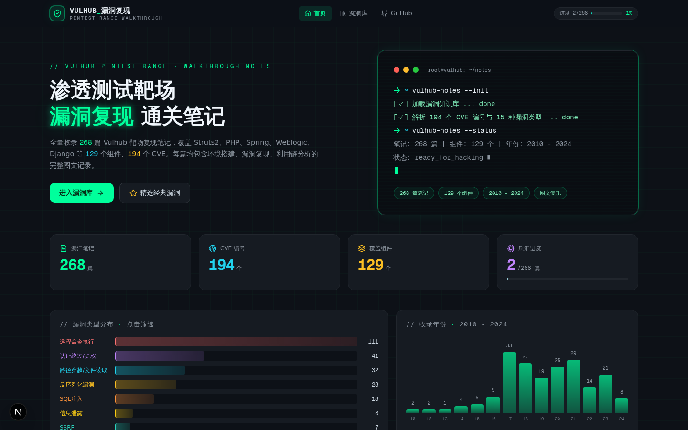
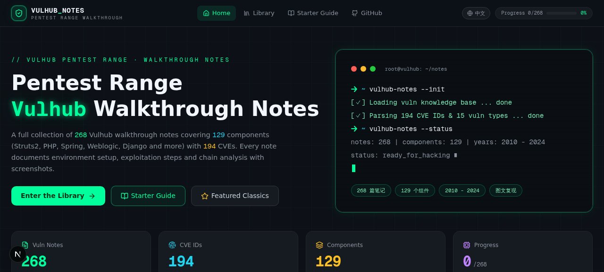
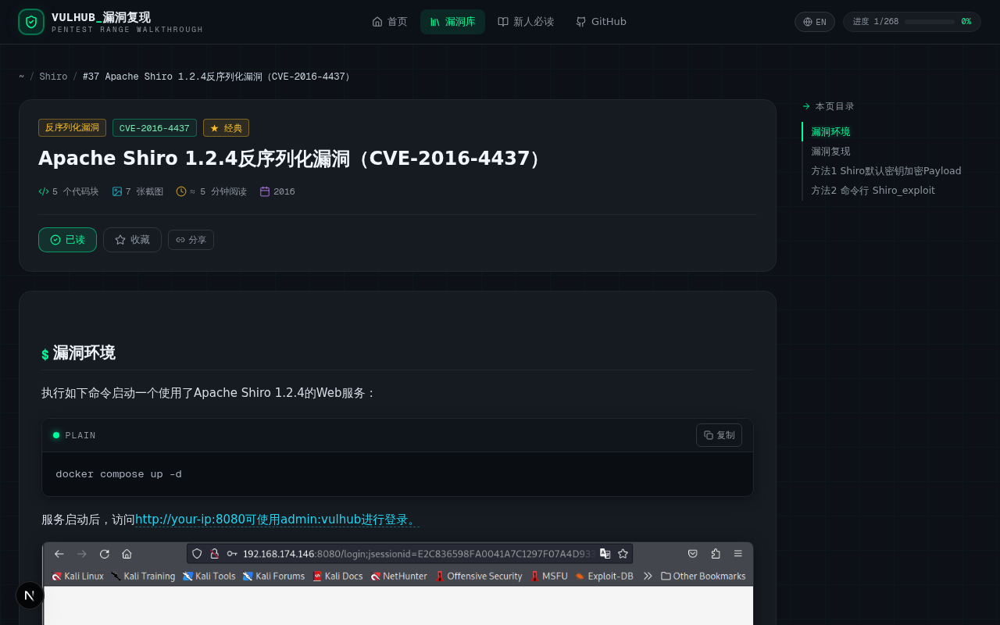
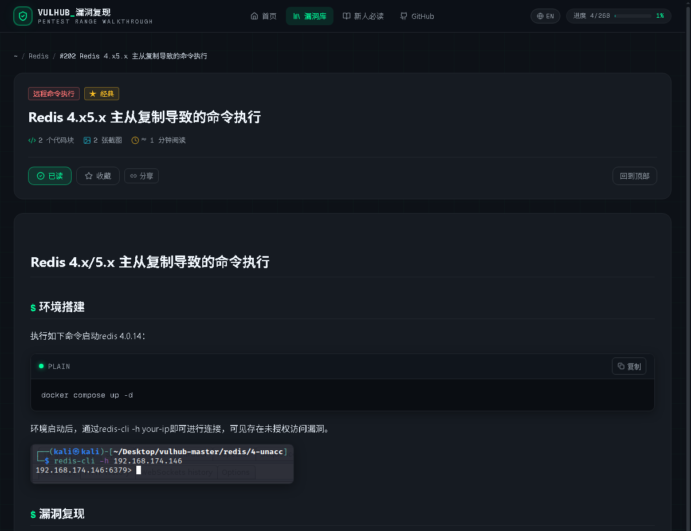
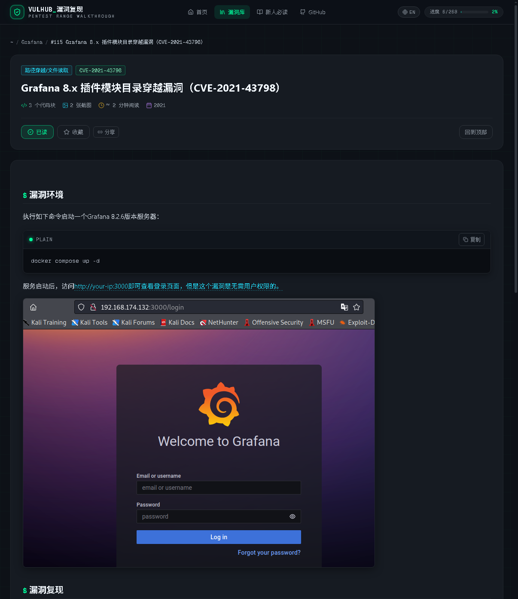

<div align="center">

**简体中文** ｜ [English](README.en.md)

# `>_ VulhubTutorialNotes`

**渗透测试靶场 · 漏洞复现通关笔记**

[](https://testdd.dpdns.org/)
[](https://testdd.dpdns.org/)
[](https://testdd.dpdns.org/)
[](https://testdd.dpdns.org/)

🌐 **在线阅读** → [https://testdd.dpdns.org](https://testdd.dpdns.org/) ｜ 镜像：[GitHub Pages](https://hacker369.github.io/VulhubTutorialNotes.github.io/)

</div>

## 📖 项目简介

这是关于本人通关 Vulhub 靶场的一系列图文教程笔记 —— 从 `docker compose up` 到 GetShell，每篇笔记都完整记录了环境搭建、漏洞复现与利用链分析的全过程。打靶场时遇到过各种奇奇怪怪的问题，翻遍资料解决之后，索性把踩过的坑一并记了下来。

为了让这些笔记更好用，我把它们做成了一个网站：全量收录 **268 篇**图文复现笔记，覆盖 **129 个**组件、**194 个** CVE 编号、**15 种**漏洞类型，时间跨度 2010 - 2024。站点采用暗黑终端风格，支持实时搜索、多维筛选、阅读进度与中英双语界面，纯静态托管，打开即用。

## ✨ 功能亮点

- 📚 **全量收录** —— 268 篇 Vulhub 靶场复现笔记，从经典老漏洞到 2024 新洞一网打尽
- 🔍 **实时搜索** —— 按标题、CVE 编号、组件名即时过滤，秒级定位目标漏洞
- 🏷️ **多维筛选** —— 15 种漏洞类型 + 129 个受影响组件，双维度组合筛选
- 📈 **统计看板** —— 漏洞类型分布、收录年份直方图，一屏掌握全库概览
- 📖 **阅读体验** —— 代码块语法高亮 + 一键复制、图片点击放大、目录锚点跳转、自动滚动高亮
- ✅ **进度管理** —— 已读标记、收藏夹、阅读进度百分比，本地持久化保存
- 🌐 **双语界面** —— 全站界面中英文一键切换（笔记正文保留中文原文）
- 🧭 **新人必读** —— Docker 环境搭建、镜像加速、靶场启动到镜像清理的完整上手指南
- ⚡ **纯静态架构** —— 无后端、无数据库，GitHub Pages 直接托管，数据与界面分离

## 📸 站点预览

<div align="center">
  
  <p><sub>▲ 暗黑终端风首页：统计看板 / 漏洞类型分布 / 收录年份直方图</sub></p>
  <br/>
  
  <p><sub>▲ 一键切换英文界面</sub></p>
  <br/>
  
  <p><sub>▲ 漏洞详情页（代码高亮 / 目录锚点 / 阅读进度）</sub></p>
  <br/>
  
  <p><sub>▲ 漏洞详情页2（代码高亮 / 目录锚点 / 阅读进度）</sub></p>
  <br/>
  
  <p><sub>▲ 漏洞详情页3（代码高亮 / 目录锚点 / 阅读进度）</sub></p>
  <br/>
</div>

## 🧭 快速开始

1. 打开 **[在线站点](https://testdd.dpdns.org/)**
2. 新手先读 **[新人必读指南](https://testdd.dpdns.org/#/guide)** —— Docker 环境安装、镜像加速配置、启动第一个靶场环境、GetShell 的完整流程，一步不落
3. 回到漏洞库，挑一个感兴趣的漏洞，跟着笔记开打

> 💡 打靶过程中 Docker 镜像越拉越多、磁盘告急？「新人必读 · 镜像清理与磁盘管理」一节整理了完整的清理命令（`docker system prune` 系列），一键释放空间。

## 🗂 仓库结构

```text
VulhubTutorialNotes.github.io
├── vulhub/                              # 268 篇漏洞复现笔记源文件（Markdown，按组件命名）
│   ├── Apache Log4j2 lookup JNDI 注入漏洞（CVE-2021-44228）.md
│   ├── Apache Shiro 1.2.4反序列化漏洞（CVE-2016-4437）.md
│   └── ...
├── data/
│   └── vulns.json                       # 站点运行时数据（由笔记源文件解析生成）
├── docs/
│   └── img/                             # README 展示截图
├── index.html                           # 静态站点入口（Next.js 静态导出）
├── _next/                               # 前端静态资源（构建产物）
├── .nojekyll                            # GitHub Pages 关键配置（禁用 Jekyll 处理）
├── CNAME                                # 自定义域名
└── README.md
```

> 若部署的是**源码版**，仓库中还会包含 `src/`（Next.js 前端源码）、`scripts/parse_vulns.py`（笔记解析脚本）与 `.github/workflows/`（自动构建流水线）。

## 🔄 内容更新指南

笔记内容与站点数据是**分离**的，日常更新无需重新构建前端：

1. **编辑笔记** —— 新增或修改 `vulhub/` 目录下的 Markdown 笔记
2. **生成数据** —— 运行解析脚本，将全部笔记聚合为 `vulns.json`（自动提取 CVE 编号、漏洞类型、组件与年份，并完成分类统计与 ID 去重）
3. **覆盖推送** —— 用生成的 `vulns.json` 覆盖仓库中的 `data/vulns.json`，提交推送
4. **自动生效** —— 等待 GitHub Pages 重新部署（1~2 分钟），全站统计看板、终端文案与筛选分类会**自动重新计算**，无需改动任何页面代码

> ⚠️ 推送时请确认 `.nojekyll` 与 `CNAME` 文件仍在仓库根目录 —— 前者丢失会导致整站白屏，后者丢失会导致自定义域名 404。
> 若部署的是源码版（含 GitHub Actions 自动构建），替换 `public/data/vulns.json` 后直接 push，流水线会自动完成构建与发布。

## ⚠️ 免责声明

- 本项目所有内容（笔记、脚本与靶场环境）**仅供安全学习与研究使用**，请勿用于任何非法用途
- 所有漏洞复现请在**本地搭建的授权靶场环境**中进行，请勿对任何未经授权的系统发起测试
- 因使用本项目内容而产生的任何直接或间接后果，由使用者自行承担，作者不承担任何责任
- 请遵守《网络安全法》及所在地区相关法律法规，共同维护良好的技术学习氛围

## 🙏 致谢

- [Vulhub](https://github.com/vulhub/vulhub) —— 本项目全部靶场环境与漏洞案例均基于 Vulhub 开源项目，感谢维护者们多年的辛勤付出
- [Next.js](https://nextjs.org/) · [Tailwind CSS](https://tailwindcss.com/) —— 站点前端技术栈
- [Shields.io](https://shields.io/) —— README 徽章服务

<div align="center">

**© 2024-present hacker369** ｜ 学习笔记，欢迎分享，转载请注明出处

[⬆ 回到顶部](#-vulhubtutorialnotes)

</div>
